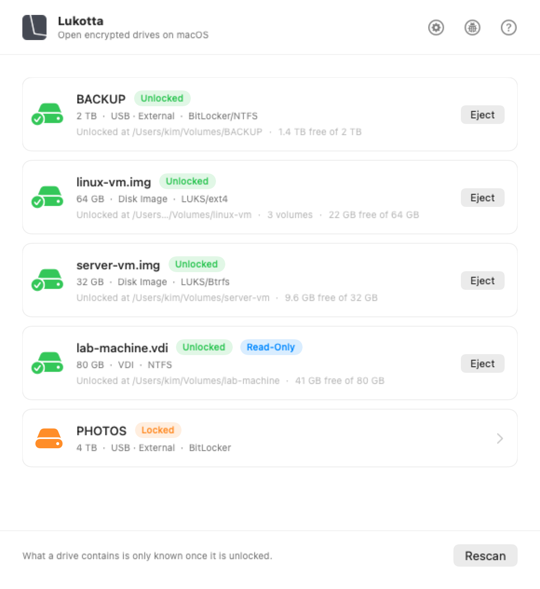
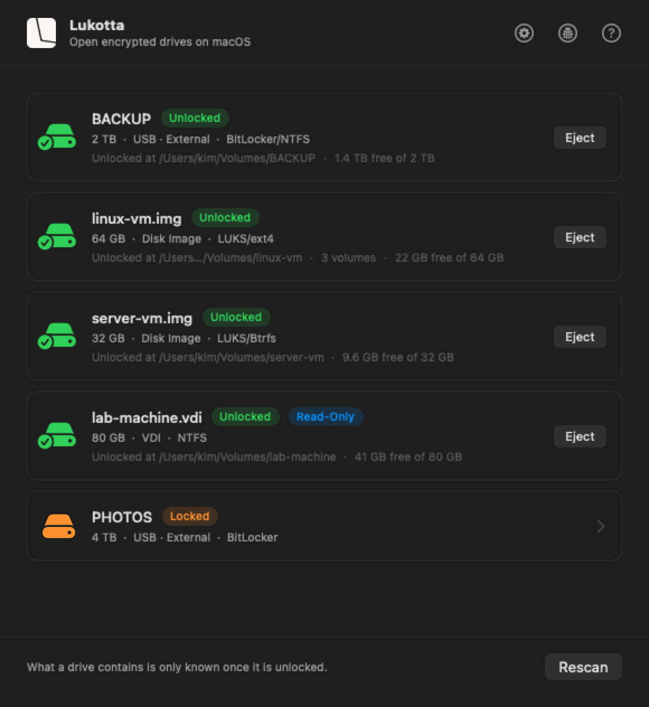

<p align="center">
  <picture>
    <source media="(prefers-color-scheme: dark)" srcset="assets/brand/lukotta-logo-dark.webp">
    <source media="(prefers-color-scheme: light)" srcset="assets/brand/lukotta-logo-light.webp">
    
  </picture>
</p>

<p align="center">
  <strong>Open BitLocker, Linux and virtual machine disks on macOS.</strong><br>
  Plug in a drive or open a disk image, type the password, and it appears in
  Finder, readable and writable, like any other disk.
</p>

<p align="center">
  
  
  
  
</p>

<p align="center">
  <a href="https://lukotta.com">lukotta.com</a> ·
  <a href="https://github.com/clementrahula/lukotta/releases">All releases</a>
</p>

<p align="center">
  <a href="https://github.com/clementrahula/lukotta/releases/latest/download/Lukotta.dmg">
    
  </a>
</p>

<p align="center">
  
  
</p>

## How It Works

macOS cannot read BitLocker or Linux filesystems; Linux can. Lukotta starts a
small Linux virtual machine, unlocks the drive inside it, and hands the drive
back to Finder.

A disk image opens the same way. The volume
appears in your home folder.

## What It Can Open

**Drives**

| | |
| --- | --- |
| **BitLocker** | Unlocked with the volume password or a 48-digit recovery key |
| **Windows NTFS** | Including ones Windows left hibernated or not shut down properly |
| **LUKS** | From Linux, both LUKS1 and LUKS2 |
| **LVM inside LUKS** | As Ubuntu, Debian, Mint and Fedora set it up. Several volumes on one drive all unlock together |
| **Filesystems** | ext4, btrfs and XFS inside them |

**Disk images**

| | |
| --- | --- |
| **Virtual machine disks** | qcow2, VMDK, VDI, VHD and VHDX, as VMware, VirtualBox, Hyper-V, QEMU and UTM write them |
| **Raw images** | `.img`, `.dmg`, and anything else macOS can attach |
| **What is inside them** | A BitLocker or LUKS volume inside any image, which unlocks like one on a drive |

qcow2, VMDK, VDI and VHD are written as well as read, so files can be copied
into a virtual machine's disk. Writing them is untested, and the screen that
opens one provides a warning. A VHDX is read and never written, as is the stream-optimized
VMDK an OVA carries; both open read-only.

An exFAT image is handed to macOS, which reads and writes that format itself.
[SPECS.md][specs] specifies every filesystem, encryption and image format, what
is written and what is not, and how each is read.

> [!WARNING]
> **Writing to qcow2, VMDK, VDI and VHD images is untested.** These drivers were
> written for Lukotta and are checked against `qemu-img` when the engine is
> built from source, but
> they have not been in use long enough for anyone to call them thoroughly tested. Writing
> to an image is at your own risk: open it read-only to copy files out safely,
> or make a backup first.

<details>
<summary>What the App Cannot Open</summary>

- Drives sealed to a TPM rather than a password, including Ubuntu's newer
  hardware-backed encryption
- LUKS volumes whose header is stored separately from the drive
- FileVault and encrypted disk images, which macOS opens itself
- Images that name another file: a VMware snapshot chain, a differencing VHD, a
  VHDX with a parent, or a qcow2 with a backing file. Lukotta opens no image
  that determines which other files are read
- A VHDX that was not shut down cleanly. Open it once in the virtual machine it
  belongs to, which writes back what it last held

</details>

## Requirements

- An Apple Silicon Mac. Intel Macs are not supported
- macOS 15 Sequoia or later
- 260 MB of disk: 160 MB for the app, 100 MB for the Linux environment it unpacks
  on first use
- 30 to 80 MB of RAM per unlocked drive
- Up to 12 drives can stay unlocked at once

## Languages

Lukotta is available in thirty-seven languages. English, and these thirty-six:

Albanian · Arabic · Bulgarian · Chinese (Simplified) · Croatian · Czech ·
Danish · Dutch · Estonian · Filipino · Finnish · French · German · Greek ·
Hebrew · Hindi · Hungarian · Indonesian · Italian · Japanese · Korean ·
Latvian · Lithuanian · Malay · Norwegian (Bokmål) · Polish ·
Portuguese (Portugal) · Romanian · Russian · Slovenian · Spanish · Swedish ·
Thai · Turkish · Ukrainian · Vietnamese

Arabic and Hebrew read right to left, and the interface turns round with them.

If a translation reads wrongly, or you would like a translation that is not listed here,
write to [support@lukotta.com][email] or to GitHub Issues. Corrections and
requests are both welcome.

## Installing

Download Lukotta from [Releases][releases], drag it to Applications, and open
it. It is signed and notarised.

## Permissions

- **Full Disk Access**: macOS will not let any app read a drive's raw contents
  without it. It cannot be requested, so it has to be switched on by hand
- **Removable volumes**: requested by macOS the first time a drive is read
- **Administrator password**: asked for once when the background helper is set
  up. Lukotta never sees it

## Using the App

Plug in the drive and pick it from the list. Type the password or paste the
recovery key. It appears in Finder under Locations.

For a disk image, choose **File → Open Disk Image…**, or **File → Open Drive…**
to see every disk attached to this Mac and what Lukotta can do with each.

Eject it from Lukotta, from the menu bar, or from Finder.

Lukotta can also auto-mount what was open after a restart. Switch on **Open drives
again after restarting** at the top of Settings: it then opens in the background
when you log in and mounts the drives and images that were open, as they were. A drive that needs a password comes back only if the
password is saved in your Keychain, and anything that is not connected is simply
passed over. It is off until you turn it on.

Lukotta remembers a passphrase in your Keychain when you ask it to.

> [!NOTE]
> The drive is handed to Finder over a local network connection, so it appears
> under Locations with a network icon. It reads, writes and ejects like any
> other drive. macOS offers no way to present it as a local disk.

## Uninstalling

Choose **Lukotta → Uninstall Lukotta…** from the menu bar. It says what it will
remove, then ejects anything open, unregisters the background helper, deletes
the Linux environment, and moves the app to the Bin.

If you asked Lukotta to remember any passphrases, it offers to delete those too
and names the drives they belong to. The offer is off by default: some are
48-digit recovery keys that exist nowhere else.

## Building

```bash
./scripts/fetch-engine.sh    # download the pinned engine, verify checksums
./scripts/build-engine.sh    # optional: build the patched engine from source
./scripts/vendor-engine.sh   # stage it into vendor/
./build-app.sh               # compile, embed, sign, install
```

The engine step is optional. Skipping it produces a working app built on
upstream's binaries, which opens fewer image formats and says by name which ones
it cannot open. [patches/README.md][patches] describes each patch.

That builds `Drive Unlocker.app`. The name and logo are trademarks that the GPL
does not license, so a build carries them only when asked. The software is the
same either way, and [TRADEMARKS.txt][trademark] says what is permitted.

The whole path, including how to reproduce a released build, is in
[BUILDING.md][building]. To work on Lukotta, see [CONTRIBUTING.md][contributing].

## Privacy and Security

Lukotta collects nothing. It makes one request of its own, a daily check for
updates, which can be turned off. [PRIVACY.md][privacy] describes it.

Your passphrase is never written to disk in the clear and never appears in a
command line. [SECURITY.md][security] describes how it is handled, what the
privileged helper accepts, and where to report a fault.

## Licence

Copyright (C) 2026 Clement Rahula.

Lukotta is free software: you can redistribute it and/or modify it under the
terms of the GNU General Public License as published by the Free Software
Foundation, either version 3 of the License, or (at your option) any later
version. It is distributed in the hope that it will be useful, but WITHOUT ANY
WARRANTY; without even the implied warranty of MERCHANTABILITY or FITNESS FOR A
PARTICULAR PURPOSE. See [the licence][licence] for the details, and
<https://www.gnu.org/licenses/> for the text of any later version.

Every source file carries `SPDX-License-Identifier: GPL-3.0-or-later`, except
those under `patches/`, which belong to other projects and carry theirs.
Complete source for every component is published with each release.

The name and the logo are trademarks, and are not covered by that licence. Fork
the code freely; give your version its own name. [TRADEMARKS.txt][trademark]
says what that means in practice.

[Licence][licence] · [Trademarks][trademark] · [Third-party notices][notices] ·
[Specs][specs] · [Releases][releases]

## About the Name

Lúkotta is Finnish for "without a lock", from *lukko*, a lock, with the ending
*-tta* marking the absence of something. The stress falls on the first syllable,
as it always does in Finnish.

## Credits

Clement Rahula · [support@lukotta.com](mailto:support@lukotta.com) ·
[rahula.dev](https://rahula.dev)

The mounting is done by [anylinuxfs][anylinuxfs], written by nohajc. Updates use
[Sparkle][sparkle]. Lukotta is not affiliated with Microsoft, Apple, or the Linux
projects it works with.

Lukotta is developed and maintained using GenAI tools, mainly the Opus 5
and Fable 5 models from Anthropic.

[email]: mailto:support@lukotta.com
[releases]: https://github.com/clementrahula/lukotta/releases
[building]: BUILDING.md
[contributing]: CONTRIBUTING.md
[privacy]: PRIVACY.md
[security]: SECURITY.md
[licence]: LICENSE.txt
[trademark]: TRADEMARKS.txt
[notices]: THIRD_PARTY_NOTICES.md
[specs]: SPECS.md
[patches]: patches/README.md
[anylinuxfs]: https://github.com/nohajc/anylinuxfs
[sparkle]: https://sparkle-project.org
