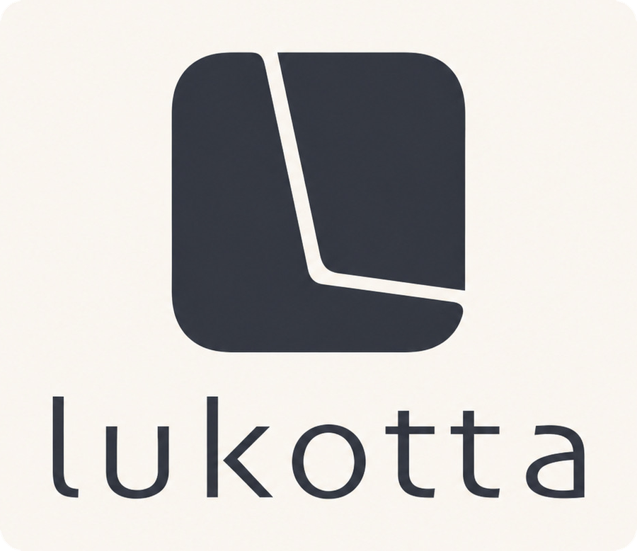

<p align="center">
  <picture>
    <source media="(prefers-color-scheme: dark)" srcset="assets/brand/lukotta-logo-dark.png">
    <source media="(prefers-color-scheme: light)" srcset="assets/brand/lukotta-logo-light.png">
    
  </picture>
</p>

<p align="center">
  <strong>Open BitLocker and Linux drives on macOS.</strong><br>
  Plug in the drive, type its password, and it appears in Finder — readable and
  writable, like any other disk.
</p>

<p align="center">
  
  
  
</p>

<p align="center">
  <a href="https://lukotta.rahula.dev">lukotta.rahula.dev</a> ·
  <a href="https://github.com/clementrahula/lukotta/releases">Download</a>
</p>

## How It Works

macOS cannot read BitLocker or Linux filesystems. Linux can. So Lukotta starts a
small Linux virtual machine, unlocks the drive inside it, and hands the drive
back to Finder.

Nothing is installed. The engine ships inside the app, nothing leaves your Mac,
and a drive is only written to when you write to it.

## What It Can Open

| | |
| --- | --- |
| **BitLocker** | Unlocked with the volume password or a 48-digit recovery key |
| **Windows NTFS** | Including ones Windows left hibernated or not shut down properly |
| **LUKS** | From Linux, both LUKS1 and LUKS2 |
| **LVM inside LUKS** | As Ubuntu, Debian, Mint and Fedora set it up. Several volumes on one drive all unlock together |
| **Filesystems** | ext4, btrfs and XFS inside them |

<details>
<summary>What it cannot open</summary>

- Drives sealed to a TPM rather than a password, including Ubuntu's newer
  hardware-backed encryption
- LUKS volumes whose header is stored separately from the drive

</details>

## Requirements

- An Apple Silicon Mac. Intel Macs are not supported
- macOS 15 Sequoia or later
- 250 MB of disk: 155 MB for the app, 95 MB for the Linux environment it unpacks
  on first use
- 30 to 80 MB of RAM per unlocked drive
- About ten drives can stay unlocked at once

## Installing

Download Lukotta from [Releases][releases], drag it to Applications, and open
it. It is signed and notarised, so it opens with a double-click.

## Permissions

- **Full Disk Access** — macOS will not let any app read a drive's raw contents
  without it. It cannot be requested, so it has to be switched on by hand
- **Removable volumes** — requested by macOS the first time a drive is read
- **Administrator password** — asked for once when the background helper is set
  up, then not again. Lukotta never sees it

> [!IMPORTANT]
> Full Disk Access is the one macOS will not prompt for. Lukotta explains it on
> first run and opens the right page of System Settings.

## Using It

Plug in the drive and pick it from the list. Type the password or paste the
recovery key. It appears in Finder under Locations.

Eject it from Lukotta, from the menu bar, or from Finder.

Lukotta can remember a passphrase in your Keychain. It does not unless you ask
it to.

> [!NOTE]
> The drive is handed to Finder over a local network connection, so it appears
> under Locations with a network icon. It reads, writes and ejects like any
> other drive. macOS offers no way to present it as a local disk.

## Uninstalling

Choose **Lukotta → Uninstall Lukotta…** from the menu bar. It says what it will
remove, then ejects anything open, unregisters the background helper, deletes
the Linux environment, and moves the app to the Bin.

Passphrases you asked Lukotta to remember are left in your Keychain. Some are
48-digit recovery keys that exist nowhere else, so removing them is left to you,
in Keychain Access.

## Building

```bash
./scripts/fetch-engine.sh    # download the pinned engine, verify checksums
./scripts/vendor-engine.sh   # stage it into vendor/
./build-app.sh               # compile, embed, sign, install
```

The whole path, including how to reproduce a released build, is in
[BUILDING.md][building]. To work on Lukotta, see [CONTRIBUTING.md][contributing].

## Privacy and Security

Nothing is collected. The only request Lukotta makes on its own is a daily check
for updates, which can be turned off — [PRIVACY.md][privacy] says exactly what
that involves.

Your passphrase never touches the disk in the clear and never appears in a
command line. [SECURITY.md][security] describes how it is handled, what the
privileged helper will and will not accept, and where to report a fault.

## Licence

Lukotta is free software under the GPL, version 3 or later. The mounting is done
by [anylinuxfs][anylinuxfs]. Complete source for every component is published
with each release.

The name and the logo are trademarks, and are not covered by that licence. Fork
the code freely; give your version its own name. [TRADEMARKS.txt][trademark]
says what that means in practice.

[Licence][licence] · [Trademarks][trademark] · [Third-party notices][notices] ·
[Changelog][changelog]

## About the Name

Lúkotta is Finnish for "without a lock", from *lukko*, a lock, with the ending
*-tta* marking the absence of something. The stress falls on the first syllable,
as it always does in Finnish.

## Credits

Clement Rahula — [lukotta@rahula.dev](mailto:lukotta@rahula.dev) ·
[rahula.dev](https://rahula.dev)

Built on [anylinuxfs][anylinuxfs] by nohajc, which does the mounting, and on
[Sparkle][sparkle] for updates. Lukotta is not affiliated with Microsoft, Apple,
or the Linux projects it works with.

[releases]: https://github.com/clementrahula/lukotta/releases
[building]: BUILDING.md
[contributing]: CONTRIBUTING.md
[privacy]: PRIVACY.md
[security]: SECURITY.md
[licence]: LICENSE.txt
[trademark]: TRADEMARKS.txt
[notices]: THIRD_PARTY_NOTICES.md
[changelog]: CHANGELOG.md
[anylinuxfs]: https://github.com/nohajc/anylinuxfs
[sparkle]: https://sparkle-project.org
