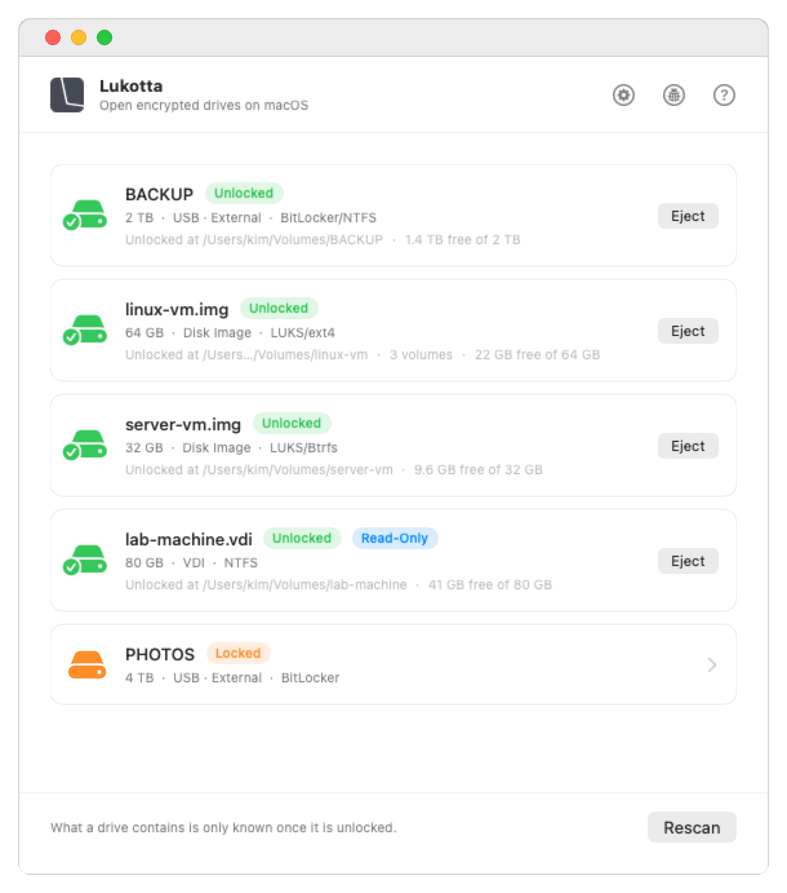
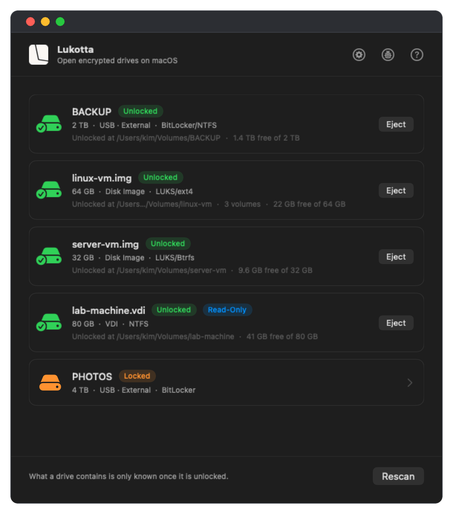

<p align="center">
  <picture>
    <source media="(prefers-color-scheme: dark)" srcset="assets/brand/lukotta-logo-dark.webp">
    <source media="(prefers-color-scheme: light)" srcset="assets/brand/lukotta-logo-light.webp">
    
  </picture>
</p>

<p align="center">
  <strong>Open BitLocker, Linux and virtual machine disks on macOS.</strong><br>
  Plug in a drive or open a disk image, type the password, and it appears in
  Finder, readable and writable, like any other disk.
</p>

<p align="center">
  
  
  
  
</p>

<p align="center">
  <a href="https://lukotta.com">lukotta.com</a> ·
  <a href="https://github.com/clementrahula/lukotta/releases">All releases</a>
</p>

<p align="center">
  <a href="https://github.com/clementrahula/lukotta/releases/latest/download/Lukotta.dmg">
    
  </a>
</p>

Or with [Homebrew](https://brew.sh):

Release:

```bash
brew install --cask clementrahula/tap/lukotta
```

Pre-release (Beta):

```bash
brew install --cask clementrahula/tap/lukotta@beta
```

<p align="center">
  
  
</p>

## About

macOS cannot mount BitLocker volumes, Linux filesystems such as ext4, btrfs and
XFS, LUKS encryption, or most virtual machine disk images. Linux can, and the
tools for it already exist.

Lukotta is built on [anylinuxfs][anylinuxfs] by nohajc, which does the mounting.
It starts a Linux microVM, hands it the drive, and exports the volume back to
macOS. Every filesystem driver, every unlock, every byte read off a disk is
anylinuxfs and the Linux kernel. If you are comfortable at a terminal, install
anylinuxfs and use it directly.

What is missing is the experience. anylinuxfs is a command-line tool: opening a
drive means knowing your disk is `/dev/disk4s1`, that the volume inside it is
`lvm:ubuntuvg:disk4s1:home`, and that you need `sudo`. The graphical wrappers
that exist mostly look like an aircraft cockpit.

This project fills that gap. Plug in a drive, type the password, and it appears
in Finder. There are no device paths, no driver names, no mount options, and no
question about which NTFS driver to try or what to do with a dirty volume, and
it covers every format macOS cannot open natively, encrypted or not.

### Where this project is

Early development, and not extensively tested. The parts doing the work are
proven: the Linux kernel's filesystem drivers, cryptsetup, LVM, anylinuxfs. What
is new is everything around them, the unlock flow and the driver choices and the
recovery when a copy goes wrong, and that is where the faults are.

The goal is to remove them. Every known fault is listed under
[Limitations](#limitations) rather than left for you to find. Until they are
gone, keep a backup of anything you cannot lose.

## What It Can Open

**Encryption**

| Format | Read | Write |
| --- | --- | --- |
| BitLocker | Yes | Yes |
| LUKS1, LUKS2 | Yes | Yes |
| LVM inside LUKS | Yes | Yes |

**Filesystems**

| Format | Read | Write |
| --- | --- | --- |
| NTFS | Yes | Yes |
| ext2, ext3, ext4, btrfs, XFS | Yes | Yes |
| exFAT, FAT † | Yes | Yes |

**Disk images**

| Format | Read | Write |
| --- | --- | --- |
| IMG, DMG † | Yes | Yes |
| qcow2 | Yes | Yes |
| VMDK \* | Yes | Yes |
| VMDK, stream-optimized \* | Yes | No |
| VDI \* | Yes | Yes |
| VHD \* | Yes | Yes |
| VHDX \* | Yes | No |

† Supported by macOS natively.

\* Support for these formats is experimental. Writing to them has not been
extensively tested.

BitLocker volumes unlock with the volume password or a 48-digit recovery key.
NTFS opens whether or not Windows shut down cleanly. LVM is read as Ubuntu,
Debian, Mint and Fedora set it up, and several volumes on one drive unlock
together. A BitLocker or LUKS volume inside an image unlocks like one on a
drive.

[SPECS.md][specs] specifies every filesystem, encryption and image format, what
is written and what is not, and how each is read.

> [!WARNING]
> **Writing to qcow2, VMDK, VDI and VHD images is untested.** These drivers were
> written for Lukotta and are checked against `qemu-img` when the engine is
> built from source, but
> they have not been in use long enough to call them thoroughly tested. Writing
> to an image is at your own risk: open it read-only to copy files out safely,
> or make a backup first.

<details>
<summary>What the App Cannot Open</summary>

- Drives sealed to a TPM rather than a password, including Ubuntu's newer
  hardware-backed encryption
- LUKS volumes whose header is stored separately from the drive
- FileVault and encrypted disk images, which macOS opens itself
- Images that name another file: a VMware snapshot chain, a differencing VHD, a
  VHDX with a parent, or a qcow2 with a backing file. Lukotta opens no image
  that determines which other files are read
- A VHDX that was not shut down cleanly. Open it once in the virtual machine it
  belongs to, which writes back what it last held

</details>

## How It Works

Nothing on the Mac reads these filesystems. Linux does, so a Linux kernel runs.

Lukotta starts a [libkrun][libkrun] microVM per opened volume, a stripped
Alpine root filesystem with 512 MB and two virtual CPUs by default, and hands it
the drive as a block device. The kernel inside mounts the filesystem with its own
driver. The volume is then exported over NFS and mounted by macOS's own NFS
client, because NFS is the one filesystem protocol macOS can mount without a
kernel extension. Finder sees a network volume; the bytes come off your disk.

The privileged part is small and separate. A device node like `/dev/disk4s1` is
`root:operator`, so an unprivileged process cannot open it. A launchd daemon
opens the device, hands the descriptor to the microVM, and drops out of the
picture; the VM itself runs as you. The app never runs as root.

**Encryption.** A BitLocker volume is unlocked inside the guest by
[cryptsetup][cryptsetup] with the volume password or a 48-digit recovery key,
which produces `/dev/mapper/btlk0`, an ordinary block device holding an
ordinary NTFS filesystem. LUKS1 and LUKS2 work the same way. The passphrase
reaches the guest through its environment and nothing else of the host's does.
A LUKS header records how much memory its key derivation needs, so the machine
is sized from the header rather than from a fixed number; a container that wants
2.5 GB gets it.

**LVM.** Ubuntu, Debian, Mint and Fedora put LVM inside the LUKS container, so
unlocking exposes a volume group rather than a filesystem. The group is
activated and *every* logical volume in it is mounted and exported from the one
machine. That matters for more than convenience: anylinuxfs locks whole physical
partitions, so several machines each wanting the same partition would collide.
One machine takes one lock, and root and home come up together, both writable.

**NTFS.** Two drivers exist and they are not interchangeable. `ntfs3` is in the
kernel, and deleting forty thousand files is forty thousand unlinks: seconds
there, an hour through FUSE. `ntfs-3g` is FUSE, slower, and more tolerant. Lukotta tries ntfs3 first, falls
back to ntfs-3g, and only then falls back to read-only. A volume Windows left
dirty is repaired rather than demoted: `ntfsfix` clears the flag and rebuilds
`$MFTMirr` from `$MFT`, gated on a dry run first reporting that it can process
both. A hibernated volume is refused outright, because writing to a disk whose
memory image is still pending is how that image is lost.

**Linux filesystems.** ext2/3/4, btrfs and XFS are mounted by the kernel's own
drivers, bare or inside LUKS. Nothing is translated or reimplemented.

**exFAT and FAT** are declined on purpose. macOS mounts them itself, natively
and locally; opening one here would turn a local volume into a network one for
no gain.

**Disk images** are read by [imago][imago], compiled into the engine, which
understands qcow2, VMDK, VDI, VHD and VHDX. An image is presented to the guest
as a block device exactly as a physical drive is, so everything above applies
unchanged: a LUKS container inside a VMDK unlocks the same way one on a USB
stick does. Images that name another file are refused, whether a snapshot
chain, a differencing VHD or a qcow2 with a backing file, because opening one
lets a file decide which other files get read.

**Getting it back to Finder.** The NFS mount is tuned for a slow drive under a
long copy, and every number in it was measured rather than chosen: `dumbtimer`
so the retry interval is what was asked for rather than an estimate that
collapses to milliseconds, a 60-second timeout, `mutejukebox` to stop macOS
announcing a server that is merely busy, and a write size of 32 KB. A large
write ahead of a directory listing in the same TCP connection is time the
listing spends waiting.

## Limitations

Everything here was measured on this hardware. Where a fix is known, it is
named.

**A file with a resource fork is silently dropped.** Copying it onto a Lukotta
volume creates nothing, and a folder copy reports success anyway. The macOS NFS
client stores every other extended attribute in an AppleDouble file beside the
original and refuses `com.apple.ResourceFork` with `EINVAL`. No mount option
reaches it. Ordinary files, Finder tags, quarantine flags and custom attributes
are unaffected; this is the resource fork alone, which mostly means old files.

**`fsync` is not durable if the machine is killed.** Data an application was
told had been committed can be lost if the microVM dies abruptly, whether from a
force quit, a crash or the power going. On ext4 and XFS the file survives with a
hole in it; on NTFS it can vanish entirely. A normal eject is safe: the app gives
the machine twenty seconds to flush and never kills one that is still writing.
Measurement rules out the engine's block cache, the NFS export and the guest's
mount options, leaving ntfs3's own fsync path.

**The folder you are copying into is slow to list.** While a large copy runs,
that one folder takes several seconds to refresh, occasionally much longer.
Every other folder on the volume answers instantly, the copy itself is
unaffected, and no error is produced. It is READDIR over NFS queued behind the
write stream: the same folder lists in 0.01 s inside the guest and 7 s across
the mount. Seven mount and driver settings were measured against it. One helped,
and it is in use.

**RAID arrays work, but the app does not yet offer them.** Lukotta claims Linux
RAID partitions so macOS stops offering to initialise them, an offer one click
from destroying an array. Assembling and serving one is proven: a two-disk RAID1
mounts through the engine and a copy onto it reads back byte-identical. `mdadm`
ships in the guest and the app reads arrays out of the engine's listing. What is
missing is the app constructing the identifier that opens one, so an array is
protected from macOS today and not yet offered to you.

**Writing to virtual machine images is not thoroughly tested.** See the warning
above. Reading is exercised heavily; writing is not.

**ZFS is not supported.** Neither the packages nor the `zfs.ko` and `spl.ko`
kernel modules ship in the guest. Whether to carry it is an open licence
question, ZFS being CDDL, as much as a technical one.

## Requirements

- An Apple Silicon Mac. Intel Macs are not supported
- macOS 15 Sequoia or later
- 260 MB of disk: 160 MB for the app, 100 MB for the Linux environment it unpacks
  on first use
- 30 to 80 MB of RAM per unlocked drive
- Up to 12 drives can stay unlocked at once

## Languages

Lukotta is available in thirty-seven languages. English, and thirty-six more:

Albanian · Arabic · Bulgarian · Chinese (Simplified) · Croatian · Czech ·
Danish · Dutch · Estonian · Filipino · Finnish · French · German · Greek ·
Hebrew · Hindi · Hungarian · Indonesian · Italian · Japanese · Korean ·
Latvian · Lithuanian · Malay · Norwegian (Bokmål) · Polish ·
Portuguese (Portugal) · Romanian · Russian · Slovenian · Spanish · Swedish ·
Thai · Turkish · Ukrainian · Vietnamese

If a translation reads wrongly, or you would like one that is not listed here,
write to [support@lukotta.com][email] or to GitHub Issues. Corrections and
requests are both welcome.

## Installing

Download Lukotta from [Releases][releases], drag it to Applications, and open
it. It is signed and notarised.

Or with [Homebrew](https://brew.sh):

Release:

```bash
brew install --cask clementrahula/tap/lukotta
```

Pre-release (Beta):

```bash
brew install --cask clementrahula/tap/lukotta@beta
```

## Permissions

- **Full Disk Access**: macOS will not let any app read a drive's raw contents
  without it. It cannot be requested, so it has to be switched on by hand
- **Removable volumes**: requested by macOS the first time a drive is read
- **Administrator password**: asked for once when the background helper is set
  up. Lukotta never sees it

## Opening a Drive

Plug in the drive and pick it from the list. Type the password or paste the
recovery key. It appears in Finder under Locations.

For a disk image, choose **File → Open Disk Image…**, or **File → Open Drive…**
to see every disk attached to this Mac and what Lukotta can do with each.

Lukotta can also auto-mount what was open after a restart. Switch on **Open drives
again after restarting** at the top of Settings: it then opens in the background
when you log in and mounts the drives and images that were open, as they were.
A drive that needs a password comes back only if the password is saved in your
Keychain, and anything that is not connected is simply
passed over. It is off until you turn it on.

Lukotta remembers a passphrase in your Keychain when you ask it to.

> [!NOTE]
> The drive is handed to Finder over a local network connection, so it appears
> under Locations with a network icon. It reads, writes and ejects like any
> other drive. macOS offers no way to present it as a local disk.

## Uninstalling

Choose **Lukotta → Uninstall Lukotta…** from the menu bar. It says what it will
remove, then ejects anything open, unregisters the background helper, deletes
the Linux environment, and moves the app to the Bin.

If you asked Lukotta to remember any passphrases, it offers to delete those too
and names the drives they belong to. The offer is off by default: some are
48-digit recovery keys that might exist nowhere else.

## Building

```bash
./scripts/fetch-engine.sh    # download the pinned engine, verify checksums
./scripts/build-engine.sh    # optional: build the patched engine from source
./scripts/vendor-engine.sh   # stage it into vendor/
./build-app.sh               # compile, embed, sign, install
```

The engine step is optional. Skipping it produces a working app built on
upstream's binaries, which opens fewer image formats and says by name which ones
it cannot open. [patches/README.md][patches] describes each patch.

That builds `Drive Unlocker.app`. The name and logo are trademarks that the GPL
does not license, so a build carries them only when asked. The software is the
same either way, and [TRADEMARKS.txt][trademark] says what is permitted.

The whole path, including how to reproduce a released build, is in
[BUILDING.md][building]. To work on Lukotta, see [CONTRIBUTING.md][contributing].

## Privacy and Security

Lukotta collects nothing. It makes one request of its own, a daily check for
updates, which can be turned off. [PRIVACY.md][privacy] describes it.

Your passphrase is never written to disk in the clear and never appears in a
command line. [SECURITY.md][security] describes how it is handled, what the
privileged helper accepts, and where to report a fault.

## Licence

Copyright (C) 2026 Clement Rahula.

Lukotta is free software: you can redistribute it and/or modify it under the
terms of the GNU General Public License as published by the Free Software
Foundation, either version 3 of the License, or (at your option) any later
version. It is distributed in the hope that it will be useful, but WITHOUT ANY
WARRANTY; without even the implied warranty of MERCHANTABILITY or FITNESS FOR A
PARTICULAR PURPOSE. See [the licence][licence] for the details, and
<https://www.gnu.org/licenses/> for the text of any later version.

Every source file carries `SPDX-License-Identifier: GPL-3.0-or-later`, except
those under `patches/`, which belong to other projects and carry theirs.
Complete source for every component is published with each release.

The name and the logo are trademarks, and are not covered by that licence. Fork
the code freely; give your version its own name. [TRADEMARKS.txt][trademark]
says what that means in practice.

[Licence][licence] · [Trademarks][trademark] · [Third-party notices][notices] ·
[Specs][specs] · [Releases][releases]

## About the Name

Lúkotta is Finnish for "without a lock", from *lukko*, a lock, with the ending
*-tta* marking the absence of something. The stress falls on the first syllable,
as it always does in Finnish.

## Credits

Clement Rahula · [support@lukotta.com](mailto:support@lukotta.com) ·
[rahula.dev](https://rahula.dev)

The mounting is done by [anylinuxfs][anylinuxfs], written by nohajc. Updates use
[Sparkle][sparkle]. Lukotta is not affiliated with Microsoft, Apple, or the Linux
projects it works with.

Lukotta is developed and maintained using GenAI tools, mainly the Opus 5
and Fable 5 models from Anthropic.

[email]: mailto:support@lukotta.com
[releases]: https://github.com/clementrahula/lukotta/releases
[building]: BUILDING.md
[contributing]: CONTRIBUTING.md
[privacy]: PRIVACY.md
[security]: SECURITY.md
[licence]: LICENSE.txt
[trademark]: TRADEMARKS.txt
[notices]: THIRD_PARTY_NOTICES.md
[specs]: SPECS.md
[patches]: patches/README.md
[anylinuxfs]: https://github.com/nohajc/anylinuxfs
[libkrun]: https://github.com/containers/libkrun
[cryptsetup]: https://gitlab.com/cryptsetup/cryptsetup
[imago]: https://crates.io/crates/imago
[sparkle]: https://sparkle-project.org
